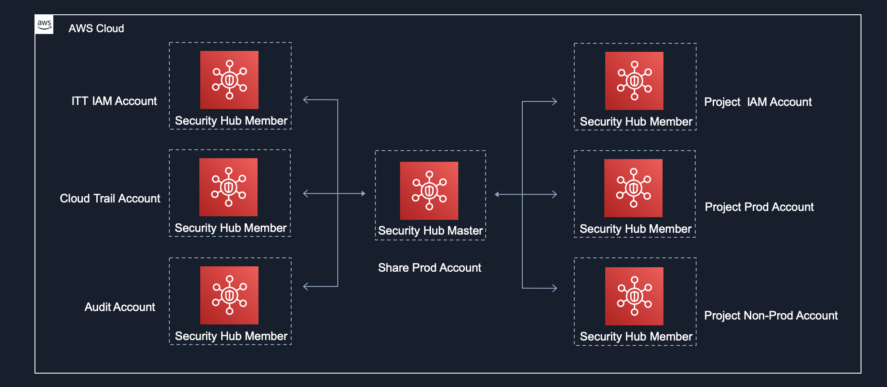
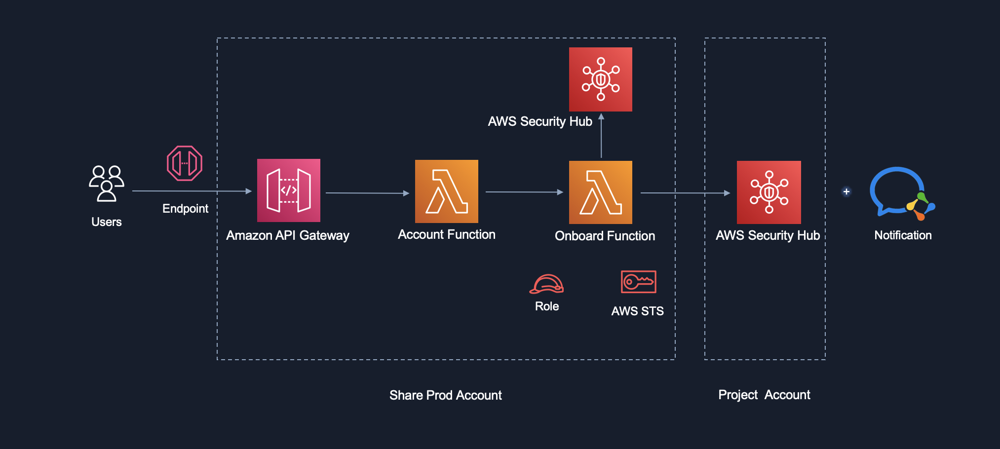
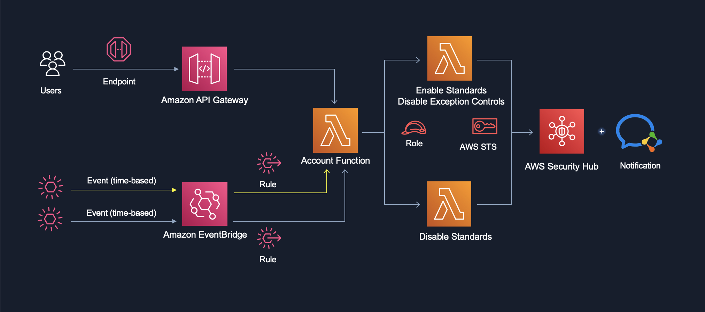
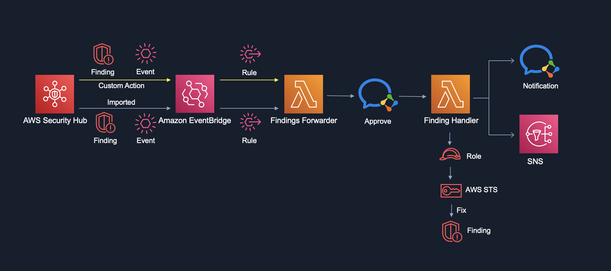
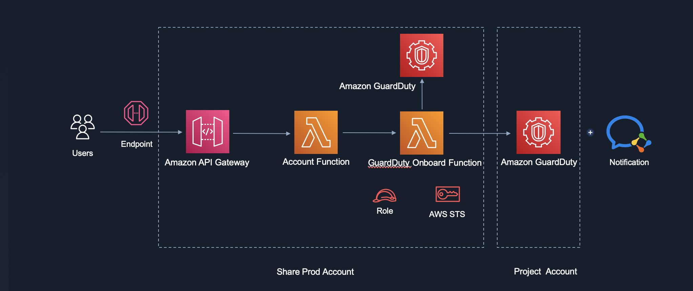
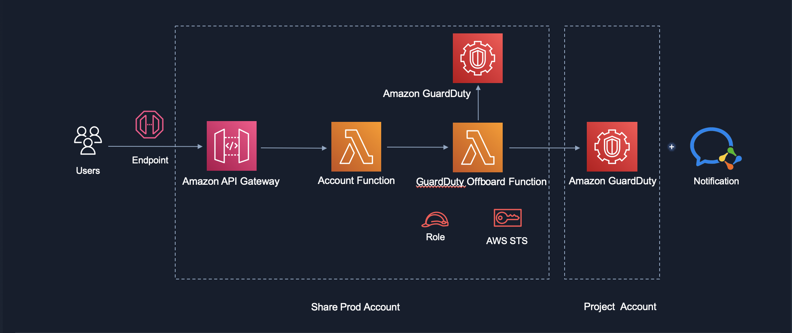
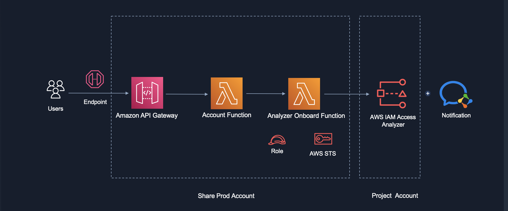

# Introduction
AWS Security Hub provides you with a comprehensive view of your security state in AWS and helps you check your environment against security industry standards and best practices.

Security Hub collects security data from across AWS accounts, services, and supported third-party partner products and helps you analyze your security trends and identify the highest priority security issues.

- https://docs.aws.amazon.com/securityhub/latest/userguide/what-is-securityhub.html

# Standards 
- AWS Foundational Security Best Practices v1.0.0
- CIS AWS Foundations Benchmark v1.2.0

## AWS Foundational Security Best Practices v1.0.0
The AWS Foundational Security Best Practices standard is a set of automated security checks that detect when AWS accounts and deployed resources do not align with security best practices. The standard is defined by AWS security experts. This curated set of controls helps improve your security posture in AWS, and covers AWS’s most popular and foundational services.

- https://docs.amazonaws.cn/en_us/securityhub/latest/userguide/securityhub-standards-fsbp.html
- https://docs.amazonaws.cn/en_us/securityhub/latest/userguide/securityhub-standards-fsbp-controls.html

## CIS AWS Foundations Benchmark v1.2.0
The Center for Internet Security (CIS) AWS Foundations Benchmark v1.2.0 is a set of security configuration best practices for AWS. This Security Hub standard automatically checks for your compliance readiness against a subset of CIS requirements.

- https://docs.amazonaws.cn/en_us/securityhub/latest/userguide/securityhub-standards-cis.html 
- https://docs.amazonaws.cn/en_us/securityhub/latest/userguide/securityhub-cis-controls.html

## Standards Control Exception

- https://git.company.com/ITT-China/aws-securityhub/blob/master/docs/AWS%20Foundational%20Security%20Best%20Practices%20v1.0.0.xlsx
- https://git.company.com/ITT-China/aws-securityhub/blob/master/docs/CIS%20AWS%20Foundations%20Benchmark%20v1.2.0.xlsx


# Architecture



# Admin Dashboard
https://console.amazonaws.cn/securityhub/home?region=cn-north-1#/summary


# Operation
- On-board
- Enable/Disable Standards
- Findings
- Integrations
- Off-board

## On-board
### Prerequisite  (Implement in AWS deployment pre-init stage)

- create ims-service-role with below info in resource account
```
{
    "projectCode": "abc",
    "RoleName": "ims-service-role",
    "AssumeRolePolicyDocument": {
        "Version": "2012-10-17",
        "Statement": [
            {
                "Effect": "Allow",
                "Principal": {
                    "AWS": "arn:aws-cn:iam::843403612003:role/service-role/abc-ims-master"
                },
                "Action": [
                    "sts:AssumeRole"
                ]
            }
        ]
    },
    "Description": "Service Role for ABC IMS",
    "Path": "/abc-ims/",
    "MaxSessionDuration": 3600
}
```

- Attach AdministratorAccess policy managed by AWS to ims-service-role

- Enable AWS Config 
	- AWS Config is required for Security Hub's security checks. Review remediation steps for the related findings for CIS 2.5. If you recently enabled AWS Config, note that it can take up to 12 hours for Security Hub to detect the change.

### Enable Service and Associate


### Process for New Account On-boarding
- Get all account ID --> Enable sechub --> Create member --> Invite member --> List invitations --> Accept invitation

#### API
```
# Example (need to replace jwtToken with real token which can get with below API)

# curl -H 'Content-Type: application/json' -X POST 'https://aqu5oyrzna.execute-api.cn-north-1.amazonaws.com.cn/dev/auth/login' -d '{
    "username": "{$username}",
    "password": "{$password}"
}'

# curl -H "Authorization: jwtToken" -H "Content-Type: application/json" -X POST "https://i06pro3vvi.execute-api.cn-north-1.amazonaws.com.cn/api/securityhub/onboard" -d '{
	"AwsAccountIds": [
        {
            "AwsAccountId": "843064179036",
            "Email": "BUShareService_dev@company.com"
	    }
    ],
	"MasterId": "843403612003"
}' 
```
#### Manually
- Just enable Security Hub service, and don't enable standards in resource account.
- Send invitation to resource account from share prod account.
- Accept the invitation from resource account.

## Enable/Disable Standards


### Enable Standards/Disable Controls
- Get all account ID --> Enable standards --> Disable controls

After you enable a security standard, AWS Security Hub begins to run all checks within two hours. Most checks begin to run within 25 minutes. 
After the initial check, the schedule for each control can be either periodic or change triggered.
 - Periodic checks run automatically within 12 hours after the most recent run. You cannot change the periodicity.
 - Change-triggered checks run when the associated resource changes state which AWS Config managed check. Even if the resource does not change state, the updated at time for change-triggered checks is refreshed every 18 hours. 

#### Time-based event/rule
- Enable two standards on every month 1st 16:00:00 GMT
- Add new account ID to inputs of this cloudwatch event rule for enable standards 

#### API

```
# Example (need to replace jwtToken with real token which can get with below API)

# curl -H 'Content-Type: application/json' -X POST 'https://aqu5oyrzna.execute-api.cn-north-1.amazonaws.com.cn/dev/auth/login' -d '{
  "username": "{$username}",
  "password": "{$password}"
}'

# curl -H "Authorization: jwtToken" -H "Content-Type: application/json" -X POST "https://i06pro3vvi.execute-api.cn-north-1.amazonaws.com.cn/api/securityhub/enable-standards" -d '{
    "AwsAccountIds": [
        {
            "AwsAccountId": "843064179036",
            "Email": "BUShareService_dev@company.com"
        }
    ],
    "ExceptionControlsIDs": [
        "CIS.1.1",
        "CIS.1.20",
        "CIS.2.4",
        "CIS.2.9",
        "CIS.3.1",
        "CIS.3.10",
        "CIS.3.11",
        "CIS.3.12",
        "CIS.3.13",
        "CIS.3.14",
        "CIS.3.2",
        "CIS.3.3",
        "CIS.3.4",
        "CIS.3.5",
        "CIS.3.6",
        "CIS.3.7",
        "CIS.3.8",
        "CIS.3.9",
        "EC2.3",
        "EC2.4",
        "EC2.6",
        "EC2.7",
        "EC2.8",
        "EC2.10",
        "KMS.2",
        "RDS.3",
        "RDS.4",
        "RDS.5",
        "RDS.6",
        "RDS.23",
        "SSM.1",
        "SSM.2",
        "SecretsManager.1",
        "S3.1",
        "Lambda.2",
        "Lambda.4",
        "ELB.3",
        "CloudTrail.5",
        "ES.1"
    ]
}'
```

### Disable Standards
- Get all account ID --> Disable standards

#### Time-based event/rule
- Disable two standards on every month 3rd 16:00:00 GMT
- Add new account ID to inputs of this cloudwatch event rule for disable standards 

#### API

```
# Example (need to replace jwtToken with real token which can get with below API)

# curl -H 'Content-Type: application/json' -X POST 'https://aqu5oyrzna.execute-api.cn-north-1.amazonaws.com.cn/dev/auth/login' -d '{
  "username": "{$username}",
  "password": "{$password}"
}'

# curl -H "Authorization: jwtToken" -H "Content-Type: application/json" -X POST "https://i06pro3vvi.execute-api.cn-north-1.amazonaws.com.cn/api/securityhub/disable-standards" -d '{
  "AwsAccountIds": [
        {
            "AwsAccountId": "843064179036",
            "Email": "BUShareService_dev@company.com"
        }
  ]
}'
```

## Findings 

### Findings Response


### EventBridge event formats for Security Hub
The Security Hub Findings - Imported, Security Findings - Custom Action, and Security Hub Insight Results event types use the following event formats.

The event format is the format that is used when Security Hub sends an event to EventBridge.

- https://docs.aws.amazon.com/securityhub/latest/userguide/securityhub-cwe-event-formats.html

### Findings for custom actions (Security Hub Findings - Custom Action) 
Security Hub also sends findings that are associated with custom actions to EventBridge as Security Hub Findings - Custom Action events.

This is useful for analysts working with the Security Hub console who want to send a specific finding, or a small set of findings, to a response or remediation workflow. You can select a custom action for up to 20 findings at a time. The set of findings is sent to EventBridge as a single EventBridge event.

When you create a custom action, you assign it a custom action ID. You can use this ID to create an EventBridge rule that takes a specified action after receiving a finding that is associated with that custom action ID. 

- https://docs.aws.amazon.com/securityhub/latest/userguide/securityhub-cwe-custom-actions.html

#### Convention
- Customer action name is standards control ID.
- Description is standards control ID.
- Custom action ID is standards control ID without dot.
- One control, one type finding, one finding hander.
- Finding handler function name is custom action ID.

#### For New Type Finding
- Define custom action.
- Add customer action arn into event rule.
- Coding finding handler.
- Trigger manually.

### All findings (Security Hub Findings - Imported) 
Security Hub automatically sends all new findings and all updates to existing findings to EventBridge as Security Hub Findings - Imported events.

Every BatchImportFindings and BatchUpdateFindings request triggers a Security Hub Findings - Imported event.

For administrator accounts, the event feed in EventBridge includes events for findings from both their account and from their member accounts.

You can define rules in EventBridge that automatically route findings to an Amazon S3 bucket, a remediation workflow, or a third-party tool. The rules can include filters that only apply the rule if the finding has specific attribute values.

You use this method to automatically send all findings, or all findings that have specific characteristics, to a response or remediation workflow. 

- https://docs.aws.amazon.com/securityhub/latest/userguide/securityhub-cwe-all-findings.html

#### Convention
- Finding handler function name is standards control ID without dot.

#### For New Type Finding
- Coding finding handler.
- Trigger automatically.

### Findings Handler Online Process
- Finding fix manually -> Evaluate risk -> Coding handler -> Add handler to deny_handler_trigger_automatically list -> Finding fix trigger manually -> handler test passed -> remove handler from deny_handler_trigger_automatically list -> Finding fix automatically

### Findings Handler List By Custom Action

|No.	| Action Name 	| Custom action ARN 							                                |Finding Handler|
|-------|---------------|-------------------------------------------------------------------------------|---------------|
|1		|APIGateway.1	|	arn:aws-cn:securityhub:cn-north-1:843403612003:action/custom/APIGateway1 	|APIGateway1	|
|2		|CIS.1.10		|	arn:aws-cn:securityhub:cn-north-1:843403612003:action/custom/CIS110			|CIS110 		|	    
|3		|CIS.2.8		|	arn:aws-cn:securityhub:cn-north-1:843403612003:action/custom/CIS28			|CIS28			|
|4		|CloudTrail.1	|	arn:aws-cn:securityhub:cn-north-1:843403612003:action/custom/CloudTrail1	|CloudTrail1	|
|5		|CloudTrail.2	|	arn:aws-cn:securityhub:cn-north-1:843403612003:action/custom/CloudTrail2	|CloudTrail2	|	
|6		|CloudTrail.4	|	arn:aws-cn:securityhub:cn-north-1:843403612003:action/custom/CloudTrail4	|CloudTrail4	|
|7		|DynamoDB.2		|	arn:aws-cn:securityhub:cn-north-1:843403612003:action/custom/DynamoDB2		|DynamoDB2		|
|8		|EC2.2			|	arn:aws-cn:securityhub:cn-north-1:843403612003:action/custom/EC22			|EC22			|
|9		|ELB.4			|	arn:aws-cn:securityhub:cn-north-1:843403612003:action/custom/ELB4			|ELB4			|
|10		|ELB.5			|	arn:aws-cn:securityhub:cn-north-1:843403612003:action/custom/ELB5			|ELB5			|
|11		|ELB.6			|	arn:aws-cn:securityhub:cn-north-1:843403612003:action/custom/ELB6			|ELB6			|
|12		|IAM.7			|	arn:aws-cn:securityhub:cn-north-1:843403612003:action/custom/IAM7			|IAM7			|
|13		|RDS.8			|	arn:aws-cn:securityhub:cn-north-1:843403612003:action/custom/RDS8			|RDS8			|
|14		|RDS.9			|	arn:aws-cn:securityhub:cn-north-1:843403612003:action/custom/RDS9			|RDS9			|
|15		|S3.2			|	arn:aws-cn:securityhub:cn-north-1:843403612003:action/custom/S32			|S32			|
|16		|S3.3			|	arn:aws-cn:securityhub:cn-north-1:843403612003:action/custom/S33			|S33			|
|17		|S3.4			|	arn:aws-cn:securityhub:cn-north-1:843403612003:action/custom/S34			|S34			|
|18		|S3.5			|	arn:aws-cn:securityhub:cn-north-1:843403612003:action/custom/S35			|S35			|
|19		|S3.6			|	arn:aws-cn:securityhub:cn-north-1:843403612003:action/custom/S36			|S36			|
|20		|SNS.1			|	arn:aws-cn:securityhub:cn-north-1:843403612003:action/custom/SNS1			|SNS1			|
|21		|SQS.1			|	arn:aws-cn:securityhub:cn-north-1:843403612003:action/custom/SQS1			|SQS1			|
|22		|IAM.2			|	arn:aws-cn:securityhub:cn-north-1:843403612003:action/custom/IAM2			|IAM2			|
|23		|IAM.3			|	arn:aws-cn:securityhub:cn-north-1:843403612003:action/custom/IAM3			|IAM3			|
|24		|IAM.5			|	arn:aws-cn:securityhub:cn-north-1:843403612003:action/custom/IAM5			|IAM5			|
|25		|IAM.8			|	arn:aws-cn:securityhub:cn-north-1:843403612003:action/custom/IAM8			|IAM8			|
|26		|RDS.20			|	arn:aws-cn:securityhub:cn-north-1:843403612003:action/custom/RDS20			|RDS20			|
|27		|Suppressed		|	arn:aws-cn:securityhub:cn-north-1:843403612003:action/custom/Suppressed		|Suppressed		|
|28		|UnSuppressed	|	arn:aws-cn:securityhub:cn-north-1:843403612003:action/custom/UnSuppressed	|UnSuppressed	|
|29		|S3.9			|	arn:aws-cn:securityhub:cn-north-1:843403612003:action/custom/S39			|S39			|

#### IAM3 handler need below tags for AWS IAM users if have AKSK
```
        "Tags": [
            {
                "Value": "Project Owner Name",     # Like  "Kong Wei Jia"
                "Key": "Owner"
            }, 
            {
                "Value": "Project Owner Mail", 
                "Key": "Email"
            }, 
            {
                "Value": "Project Name", 
                "Key": "Project"
            },
            {
                "Value": "Local",   # value is Local or Service
                "Key": "Usage"
            },
                        {
                "Value": "For .....",   
                "Key": "Description"
            }
        ]
```


## Integrations
### GuardDuty
#### Onboard


##### Process
- Get all account ID --> Create detector --> Create members --> Invite members --> List invitations --> Accept invitation

##### API

```
# Example (need to replace jwtToken with real token which can get with below API)

# curl -H 'Content-Type: application/json' -X POST 'https://aqu5oyrzna.execute-api.cn-north-1.amazonaws.com.cn/dev/auth/login' -d '{
  "username": "{$username}",
  "password": "{$password}"
}'

# curl -H "Authorization: jwtToken" -H "Content-Type: application/json" -X POST "https://i06pro3vvi.execute-api.cn-north-1.amazonaws.com.cn/api/securityhub/guardduty-onboard" -d '{
	"AwsAccountIds": [
        {
            "AwsAccountId": "843064179036",
            "Email": "BUShareService_dev@company.com"
        }
    ],
	"MasterId": "843403612003"
}'
```

#### Offboard


##### Process
- Get all account ID --> Disassociate members --> Delete members --> Delete detector

##### API

```
# Example (need to replace jwtToken with real token which can get with below API)

# curl -H 'Content-Type: application/json' -X POST 'https://aqu5oyrzna.execute-api.cn-north-1.amazonaws.com.cn/dev/auth/login' -d '{
  "username": "{$username}",
  "password": "{$password}"
}'

# curl -H "Authorization: jwtToken" -H "Content-Type: application/json" -X POST "https://i06pro3vvi.execute-api.cn-north-1.amazonaws.com.cn/api/securityhub/guardduty-offboard" -d '{
	"AwsAccountIds": [
        {
            "AwsAccountId": "843064179036",
            "Email": "BUShareService_dev@company.com"
        }
    ],
	"MasterId": "843403612003"
}'
```

### IAM access analyzer


#### API

```
# Example (need to replace jwtToken with real token which can get with below API)

# curl -H 'Content-Type: application/json' -X POST 'https://aqu5oyrzna.execute-api.cn-north-1.amazonaws.com.cn/dev/auth/login' -d '{
  "username": "{$username}",
  "password": "{$password}"
}'

# curl -H "Authorization: jwtToken" -H "Content-Type: application/json" -X POST "https://i06pro3vvi.execute-api.cn-north-1.amazonaws.com.cn/api/securityhub/iamanalyzer-onboard" -d '{
	"AwsAccountIds": [
        {
            "AwsAccountId": "843064179036",
            "Email": "BUShareService_dev@company.com"
        }
    ]
}'
```

## Off-board


### Process
- Get all account ID --> Disassociate members --> Delete members --> Disable securityhub

### API

```
# Example (need to replace jwtToken with real token which can get with below API)

# curl -H 'Content-Type: application/json' -X POST 'https://aqu5oyrzna.execute-api.cn-north-1.amazonaws.com.cn/dev/auth/login' -d '{
  "username": "{$username}",
  "password": "{$password}"
}'

# curl -H "Authorization: jwtToken" -H "Content-Type: application/json" -X POST "https://i06pro3vvi.execute-api.cn-north-1.amazonaws.com.cn/api/securityhub/offboard" -d '{
	"AwsAccountIds": [
        {
            "AwsAccountId": "843064179036",
            "Email": "BUShareService_dev@company.com"
	    }
    ],
	"MasterId": "843403612003"
}'
```

# Solution Deployment (CI/CD)
  - Coding with Chalice framework in local
  - Git commit
  - Trigger CI/CD pipeline automatically
    - Checkout
    - Chalice deploy


# Follow Up
## Improve and Optimize pipeline
- findings
    - Add approve/deny/suppress stage (by finding type if effect business)
    - Add Jira stage

## Coding/Update Finding Handler
- IAM.3
- Other new type finding
- guardduty
- accessanalyzer

## Don't depend on other API or other actions, need to be independent solution.
- SecHub Init (Role and Config)
- Auth
- Send message (wechat/mail)


